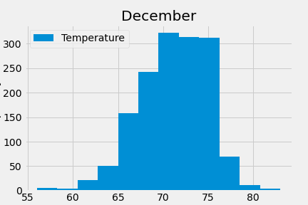

# Overview
Visualize climate data to prepare a surf and ice cream shop in Hawaii to open and determine year-round sustainability.

## Resources
- SQLite database: hawaii.sqlite
- Python, Pandas, SQLAlchemy, Flask

## Results
### June Temperature Summary

 

### December Temperature Summary

- When comparing the means, there is less than four degrees difference, so December temperatures on average are not too much colder than June temperatures.
- The max temperatures of each month are similar at 85 and 83 degrees for June and December, respectively.
- The minimum temperatures show the greatest contrast with December's minimum temperature at 56 while June's minimum is 64. 

## Summary
On average, historical June and December temperatures do not differ that much. Based on the metric of temperature only, one could assume that the surf and ice cream shop would be prudent to stay open year-round. 

However, further analysis is required to give a confident recommendation to the investors. At this point, I recommend two additional queries to visualize precipitation levels in June and December. 